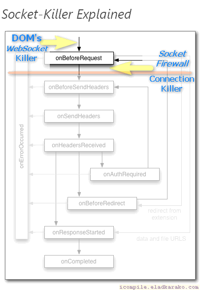

<h1> API-Killer-WebSocket</h1>

<ul>
<li> &nbsp; (prefered) <a href="https://github.com/eladkarako/chrome_extensions/releases/tag/LatestFirefox">https://github.com/eladkarako/chrome_extensions/releases/tag/LatestFirefox</a></li>
<li>  &nbsp; (prefered) <a href="https://github.com/eladkarako/chrome_extensions/releases/tag/LatestChrome">https://github.com/eladkarako/chrome_extensions/releases/tag/LatestChrome</a></li>
<!-- li>   &nbsp; (external) <a href="https://chrome.google.com/webstore/detail/niekhfkkkdlijikahmbnalbdjplhckfp/">https://chrome.google.com/webstore/detail/niekhfkkkdlijikahmbnalbdjplhckfp/</a></li -->
<li>  &nbsp; (external) <a href="https://addons.mozilla.org/en-GB/firefox/addon/api-killer-websocket/">https://addons.mozilla.org/en-GB/firefox/addon/api-killer-websocket/</a></li>
</ul>

<strong>Socket HEADSHOT!</strong>

<ul>
<li>100% Web-Socket Blocking!</li>
<li>Safe! All Websites Simply Use The Standard Connection.</li>
<li>Just Works! No Configurations Needed.</li>
</ul>

<strong>How?</strong> <em>(Technical)</em>

<ol>
<li><code>at_document_start.js</code> -&gt; <code>at_document_end.js</code> -&gt; <code>at_document_idle.js</code> action: Prevents DOM Usage Of <code>WebSocket</code> Object Constructor, by null'ifying it on initial-load, DOM-load complete and Window load stages.</li>
<li>The Manifest Attribute <code>"all_frames": true</code> Will <em>Also</em> Run [1] (Above) On Main Page, But <strong>Also</strong> On Every Sub-Frame! This Will Help You Combat Various IFRAME-Slaves Used By Various Companies (Google, eBay,..) - <strong>There Is No Sneaking Pass It</strong>.</li>
<li><code>background_request_manipulation.js</code> Will <em>Safely</em> Provides An Extra Protection-Layer, It Will Inspect <em>Socket Connection</em>, Both By Blocking Regular And <strong>Background/Hidden</strong> Connections Using The <code>ws://</code> Or <code>wss://</code> Schemes <strong>And</strong> By Explicitly Blocking The <code>websocket</code> Connection-Type For All URLs. This Will Stop Every Socket-Connection Even <strong>Before It Gets To Connect!</strong></li>
<li>[3] (Above) Will Stop Connections From Plugins Too! Ultimate Protection!</li>
</ol>

<strong>When this web-extension will only work partially (not a full API-blocking)?</strong>
Some servers can prevent external-JavaScript from running on their pages, this includes JavaScript from web-extensions. It is usually done by serving the web-page with an additional 'Content-Security-Policy' header with the value 'default-src none', for example (https://addons.mozilla.org does it, and it prevents all, no just mine, web-extensions from working on that sub-domain). There isn't much to do in that matter, Firefox was designed to block web-extensions' JavaScript in those cases (yes, this web-extension's JavaScript too). When ever possible, I add an additional network-filter to each of my web-extension, for an increased security, those will always keep on working.

I've basically made this web-extension for myself, and then decided to share it with everyone, because sharing is caring. it's nothing fancy but it is small, quick and it works. If you've enjoyed using it I'll be thrilled to hear all about it in the review section. 

100% free (as beer..), include no ads (I hate those!), does NOT collect any data, includes NO analytics and works entirely offline.

<pre>
Developer's HUB / Changelog

1.0.3.10
* removed manually-generated string of the core-DOM function, in-favor of grabbing the actual-function string ('.toString') with reduced whitespace, this because of Mozilla-reviewers keeping flagging the string-injection as an obfuscated code (it is not).
+ added execution from DOM-aspect.

1.0.3.8
* permission update for closed-tabs check before updating web-extension badge-number.

1.0.3.7
* minor change in the code-injection, wrapping with some proper XHTML-content 'protection'.

1.0.3.3
* generator-tools such as TinyMCE that are using an IFRAME to generate dynamic-HTML can display my injected SCRIPT-elements as a text, I'm applying a "strong override style" to avoid those from being displayed (as plain text). This is actually a bug-fix for TinyMCE (workaround from my end..).

1.0.3.1
* improving JavaScript-related removing of WebSocket methods.

1.0.2.13
* changed the way the SRC is stored internally, instead of using the content of the 'api_killer_websocket' function dynamically, simply put the string there as it is, which seems to run faster and is more compatible with whitespace across OS.

1.0.2.9
* slight engine modification.

1.0.2.8
* holding element-query multi-line string without the use of multiline method.

1.0.2.7
* improving cross-browser-API compatibility.

1.0.2.6
* explicit apply changes only for text/html pages.
+ adding support for about:blank pages.

1.0.2.5
+ adding action-counter in icon-badge.

1.0.2.4
* improving injected-script by applying its content with innerHTML to workaround text-nodes are unavailable in early page-loading stages.

1.0.2.1
* improved DOM script-injection with blocking mode for making sure it will effect from the very start.

1.0.1.5
+ error handling with tab closing too fast.

1.0.1.4
+ added support for Chrome's idle state.
- reduce package size.
- limit re-discovery to once per-page life-cycle state-change (load/ready).

1.0.1.3
* improved method applying mode.

1.0.1.2
+ null'ify the DOM's WebSocket Object.

1.0.0.1
+ initial.
</pre>

<!--  -->