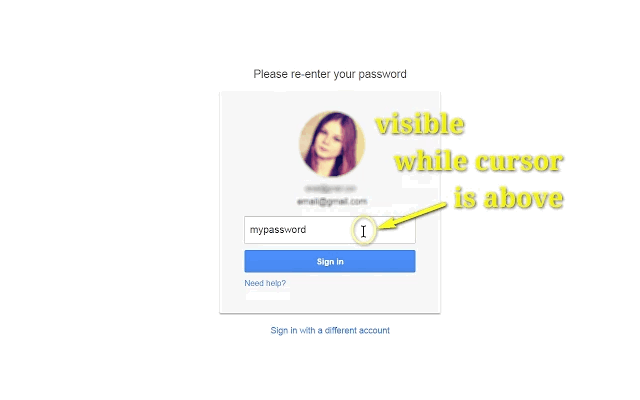

<h1> Behind-The-Asterisks</h1>

<ul>
<li> &nbsp; (prefered) <a href="https://github.com/eladkarako/chrome_extensions/releases/tag/LatestFirefox">https://github.com/eladkarako/chrome_extensions/releases/tag/LatestFirefox</a></li>
<li>  &nbsp; (prefered) <a href="https://github.com/eladkarako/chrome_extensions/releases/tag/LatestChrome">https://github.com/eladkarako/chrome_extensions/releases/tag/LatestChrome</a></li>
<!-- li>   &nbsp; (external) <a href="https://chrome.google.com/webstore/detail/niekhfkkkdlijikahmbnalbdjplhckfp/">https://chrome.google.com/webstore/detail/niekhfkkkdlijikahmbnalbdjplhckfp/</a></li -->
<li>  &nbsp; (external) <a href="https://addons.mozilla.org/en-GB/firefox/addon/behind-the-asterisks-webext/">https://addons.mozilla.org/en-GB/firefox/addon/behind-the-asterisks-webext/</a></li>
</ul>

<strong>Reveal What Is Behind The Asterisks Of A Password On Mouse Hover.</strong>

<strong>Ever mistype a password, and were had to delete all the characters- and wrote the whole thing again?</strong>

I think hiding a password behind "*" on YOUR OWN PC is rather pointless.

so I've wrote this web-extension to help me copy & paste, 
or edit long passwords very easily,

and once you move your mouse-cursor away, it's hidden again!
Easy!

<strong>When this web-extension will only work partially (not a full API-blocking)?</strong>
Some servers can prevent external-JavaScript from running on their pages, this includes JavaScript from web-extensions. It is usually done by serving the web-page with an additional 'Content-Security-Policy' header with the value 'default-src none', for example (https://addons.mozilla.org does it, and it prevents all, no just mine, web-extensions from working on that sub-domain). There isn't much to do in that matter, Firefox was designed to block web-extensions' JavaScript in those cases (yes, this web-extension's JavaScript too). When ever possible, I add an additional network-filter to each of my web-extension, for an increased security, those will always keep on working.

I've basically made this web-extension for myself, and then decided to share it with everyone, because sharing is caring. it's nothing fancy but it is small, quick and it works. If you've enjoyed using it I'll be thrilled to hear all about it in the review section. 

100% free (as beer..), include no ads (I hate those!), does NOT collect any data, includes NO analytics and works entirely offline.

<pre>
Developer's HUB / Changelog

4.0.3.3
* additional repeat main method check, with alarms-api.

4.0.3.2
* cleanup old event-hooks.

4.0.3.1
* improving cross-browser-API compatibility.

4.0.2.4
* using compatible event handler (non-passive).

4.0.2.1
+ added support for Chrome's idle state.
- reduce package size.
- limit re-discovery to once per-page life-cycle state-change (load/ready).

4.0.1.9
* fix engine-loading.

4.0.1.8
+ error handling

4.0.1.7
* engine update with improved id-logic.

4.0.1.5
* extension description update with emoji.

4.0.1.3
+ error-handling.

4.0.1.2
* adding prototyping for browser compatibility.

4.0.1.1
* tag-number updated instead of overriding it.

4.0.0.2
* engine update.

4.0.0.1
* project architecture, support execution on pages with and without JavaScript support, no code-duplication using the scope of the chrome-extension.

3.0.2.2
* Execution start earlier, for heavy pages.

3.0.1.1
* Enhance code-engine.
+ HoverText to Behind-The-Asterisks (Same as my 'old' Firefox-Extension name.. :])

2.1.0.3
* store mouse-hover state as object-oriented attribute instead of HTML element-attribute.

2.1.0.1
- limit mouse enter/leave event, in-favor of in/over.
* always execute main action in friendly non-blocking way.

2.0.3.1
+ Initial (no up-versioning while I've developed it...)
</pre>

How Does It Works?
- Hover Your Mouse-Cursor Above Any Password-Fields, To See Its Text-Content.
- Easily Edit Any Password-Field Text-Content, Copy And Paste Fully Supported.
- As Soon You'll Move Away Your Mouse-Cursor Or When Done With The Editing And Focus Something Else On The Page,
  The Password Field Will Be Back In Its *** Or ••• Form.

<!--  -->