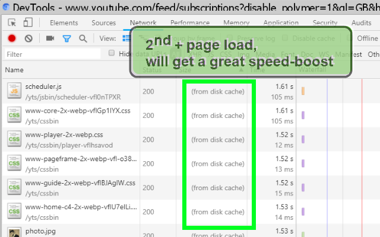

<h1> Chrome-Extension-Boostaler</h1>

<strong>Boost By Stale.</strong>

This web-extension will reconfigure the cache-control headers for each of the requests to the page's resources (such as CSS-file, images and media-files) allowing a much longer-period of time for each resource to stay in the browser-cache, but still checking to see if the resources is the most recent one available.
In additional it make use of an experimental addition to the cache-control headers called "stale-while-revalidate" allowing the resources to load "one more time" while the fresher, newer resource is being downloaded in the background, ready to be served in the next time. This whole magic is done by the browser, the Boostaler web-extension simply activates the cool-stuff you already have.

I've basically made this web-extension for myself, and then decided to share it with everyone, because sharing is caring. it's nothing fancy but it is small, quick and it works. If you've enjoyed using it I'll be thrilled to hear all about it in the review section. 

100% free (as beer..), include no ads (I hate those!), does NOT collect any data, include NO analytics and works entirely offline.

For Chrome please enable either <code>chrome://flags/#enable-stale-while-revalidate</code> or use the <code>--enable-stale-while-revalidate --enable-offline-load-stale-cache</code> command-line flag with <code>chrome.exe</code> for the full effect.

Firefox does not need setting any special configuration or switches.

 

<h3>This Extension Is A Great Way To Enhance Browsing :)</h3>

<h3>Read about:</h3>
stale in <code>Cache-Control</code> header: <a href="https://tools.ietf.org/html/rfc5861">https://tools.ietf.org/html/rfc5861</a> (includes examples- but technical).

<pre>
Developer's HUB / Changelog

2.0.9.6
* restricted variant modification fix.

2.0.9.2
* improving cross-browser-API compatibility.

2.0.9.1
+ updating list-of-available, cache'able elements to Chrome's max value according to https://developer.chrome.com/extensions/webRequest , which adds media :]
* improving caching-system, enabling cache for everything (tryout...)

2.0.8.5
- prefer stale for resources only (not pages) to improve stability.
+ allowing stale on XHR to speed up dynamic pages (YouTube!).
* prefer using '--enable-stale-while-revalidate --enable-offline-load-stale-cache' command line switches to Chrome's-shortcut. The chrome-flag is removed on newer Chrome versions.

2.0.8.3
+ have stale directive on my request types (but not XHR ones!)

2.0.8.2
+ initial: (no versioning while was in-active alpha-stage :] ).
</pre>

<!--  -->