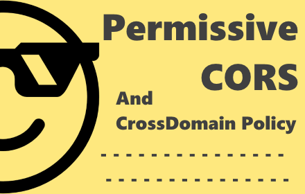

<h1> CORS</h1>

<ul>
<li> &nbsp; (prefered) <a href="https://github.com/eladkarako/chrome_extensions/releases/tag/LatestFirefox">https://github.com/eladkarako/chrome_extensions/releases/tag/LatestFirefox</a></li>
<li>  &nbsp; (prefered) <a href="https://github.com/eladkarako/chrome_extensions/releases/tag/LatestChrome">https://github.com/eladkarako/chrome_extensions/releases/tag/LatestChrome</a></li>
<li>   &nbsp; (external) <a href="https://chrome.google.com/webstore/detail/nnlclodalppllianmmohmhejidoncabi/">https://chrome.google.com/webstore/detail/okllieelegmmjlkfnddadhblbgejeido/</a></li>
<li>  &nbsp; (external) <a href="https://addons.mozilla.org/en-GB/firefox/addon/cors-webext/">https://addons.mozilla.org/en-GB/firefox/addon/cors-webext/</a></li>
</ul>

This web-extension both adds a very permissive HTML5 cross-domain headers, 
and also provides a very permissive 'CrossDomain.xml' and 'ClientAccessPolicy.xml' suitable for 
Flash, ASP.Net and Silverlight.

This web-extension will make it 'as if' every server includes those CORS-headers, 'CrossDomain.xml' and 'ClientAccessPolicy.xml', 
regardless if that (any) server has them already. This makes every website-resource in any server fully accessible for download.

The Very permissive set of HTML5-CORS headers will allow you to use JavaScript to fetch any resources, regardless 
its source of origin, in-additional you can query the XMLHTTPRequest object for all of the headers (including 'Content-Length') which 
is usually blocked. Another positive 'side-effect' you can use is that of the CANVAS-element, which will never get tainted, so you can use always the '.getImageData()' method.

The Very permissive 'CrossDomain.xml' and 'ClientAccessPolicy.xml' can allow you full-access to website resources using legacy-plugins, 
it does not change any of the browser's policy regarding those plugins (newer Chrome/Firefox will usually disable those), 
but if you use old versions of Firefox or Chrome (or the WaterFox browser) you might find it useful.

I've basically made this web-extension for myself, and then decided to share it with everyone, because sharing is caring. it's nothing fancy but it is small, quick and it works. If you've enjoyed using it I'll be thrilled to hear all about it in the review section. 

100% free (as beer..), include no ads (I hate those!), does NOT collect any data, include NO analytics and works entirely offline.

<pre>
Developer's HUB / Changelog

2.0.0.8
* improving cross-browser-API compatibility.

2.0.0.2
+ adding additional header to expose and allow.

2.0.0.1
+ initial.
</pre>

<!--  -->