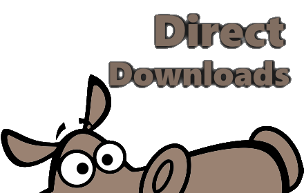
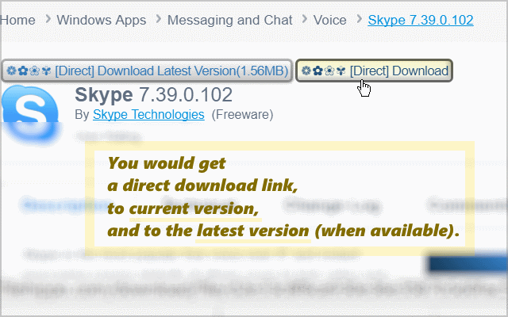

<h1> Direct-FileHippo</h1>

This web-extension makes downloading from FileHippo much easier, 
by adding a direct-link to the full-real (previously hidden) download on the top of the page, 
helping you to avoid downloading that 'malware 3'rd-party downloader' application.

I've basically made this web-extension for myself, and then decided to share it with everyone, because sharing is caring. it's nothing fancy but it is small, quick and it works. If you've enjoyed using it I'll be thrilled to hear all about it in the review section. 

100% free (as beer..), include no ads (I hate those!), does NOT collect any data, includes NO analytics and works entirely offline.

   

   

<strong>Chrome users:</strong>
You can reduce all the ads from the website by blocking JavaScript and cookies from 
<code>[*.]filehippo.com</code>, in <code>chrome://settings/content/javascript</code> and <code>chrome://settings/content/cookies</code>.
You can search filehippo using Google with (for example we're searching skype) <code>site:filehippo.com skype</code> - try it yourself: <a href="https://www.google.com/search?num=50&gbv=1&q=site%3Afilehippo.com+skype">https://www.google.com/search?num=50&gbv=1&q=site%3Afilehippo.com+skype</a>.

<pre>
Developer's HUB / Changelog

3.0.0.11
* changing the browser_specific_settings/gecko/id to re-upload to Mozilla-servers.

3.0.0.10
* additional repeat main method check, with alarms-api.

3.0.0.9
* improving cross-browser-CSS vendor-specific rules.

3.0.0.3
* improving cross-browser-API compatibility.

3.0.0.2
* restyle button with simpler quicker to render style.
* simplified code - unique URLs checking area.
* process by element-found - so element is available for gathering information such as original URL and original inner-text.

3.0.0.1
* engine simplified.
+ making sure URLs are unique, both on elemement-query and after resolving to direct-URL, so there will be truly one-link/per-url.

2.0.0.2
* put download button above other layers.

2.0.0.1
+ initial
</pre>

<!--  -->
