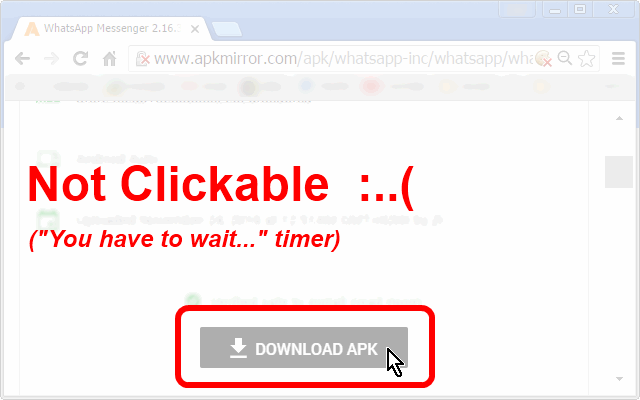

<h1> Chrome-Extension-Enabler</h1>

<strong>Immediately Enable Everything</strong>

👆︎ Enables disabled buttons.

👀︎ Reveals hidden content.

📖︎ Removes text selection limits.

👇︎ Enables touch gestures and scrolling everywhere.

👔︎ Zero configuration needed. Plug&Play.

🌼︎ 🌼︎ 🌼︎ 🌼︎ 🌼︎ 🌼︎ 🌼︎

<strong>When this web-extension will only work partially (not a full API-blocking)?</strong>
Some servers can prevent external-JavaScript from running on their pages, this includes JavaScript from web-extensions. It is usually done by serving the web-page with an additional 'Content-Security-Policy' header with the value 'default-src none', for example (https://addons.mozilla.org does it, and it prevents all, no just mine, web-extensions from working on that sub-domain). There isn't much to do in that matter, Firefox was designed to block web-extensions' JavaScript in those cases (yes, this web-extension's JavaScript too). When ever possible, I add an additional network-filter to each of my web-extension, for an increased security, those will always keep on working.

I've basically made this web-extension for myself, and then decided to share it with everyone, because sharing is caring. it's nothing fancy but it is small, quick and it works. If you've enjoyed using it I'll be thrilled to hear all about it in the review section. 

100% free (as beer..), include no ads (I hate those!), does NOT collect any data, includes NO analytics and works entirely offline.

<h3>Especially useful on websites that include some-kind of "wait until you could click the button" timer,
(such as download websites) - well No more!</h3>

<h3>This Extension Is A HUGE Time-Saver!!!</h3>

<pre>
Developer's HUB / Changelog

3.0.2.17
* code-cleanup.

3.0.2.16
* additional repeat main method check, with alarms-api.

3.0.2.15
* improving cross-browser-API compatibility.

3.0.2.9
* updating html/body overflow for better visibility.

3.0.2.8
+ handling "controlslist" to allow downloading media-elements.

3.0.2.7
* improved main content scroll behavior.

3.0.2.6
+ added support for Chrome's idle state.
- reduce package size.
- limit re-discovery to once per-page life-cycle state-change (load/ready).

3.0.2.5
* fix engine-loading.

3.0.2.4
+ error handling

3.0.2.3
* improved visibility rules to force display hidden html/body when hidden by abusive adblocking plugins and such..

3.0.2.1
* improved display rules to make sure page is always visible.

3.0.1.9
- removed the 'always allow scroll-bars' css-rule (although useful on some cases).

3.0.1.8
* engine update: allowing scrolling page's content (if needed), this helps to counter many (!) content-limitation used in modal and in-page pop-ups.

3.0.1.6
* engine fix, for repetition-flag

3.0.1.4
* limit repetition by flag done-elements.

3.0.1.3
+ error handling

3.0.1.2
* adding prototyping for browser compatibility.

3.0.1.1
* tag-number updated instead of overriding it.

3.0.0.5
+ Added awsome rule to always display the HTML/BODY, to counter some malicious websites blocking main content until some condition is met.. :/

3.0.0.1
* project architecture, support execution on pages with and without JavaScript support, no code-duplication using the scope of the chrome-extension.

2.0.1.8
* update CSS-Rules override for cursor (for other page life-cycle states).

2.0.1.7
- remove CSS-Rules override for cursor.

2.0.1.6
* engine cases error-handling.

2.0.1.5
- removing user-modified rules since it may override contentEditable attributes.

2.0.1.3
- removing inline-style matching and handling.
* Engine update with some more counter-CSS rules.

2.0.1.1
+ Engine update with some more counter-CSS rules.

1.0.0.5
+ initial.
</pre>

<!--  -->