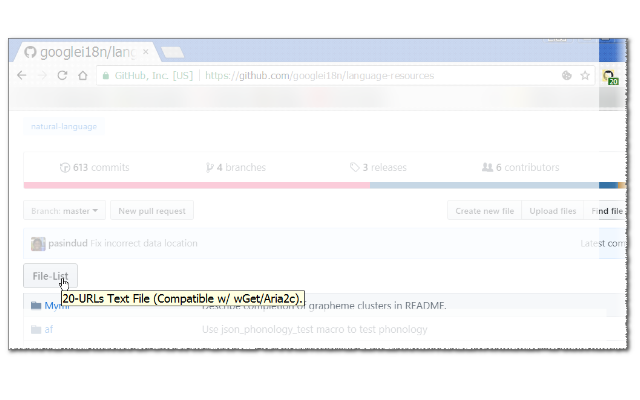

<h1> Chrome-Extension-GitHub-Download-List</h1>

<h3><em>★★★★★ Get You A Button To Download A List Of All Files The In-Page.</em></h3>

Will not play nice with GitHub's <code>JS-Navigation</code>,
But you can always install <a href="https://github.com/eladkarako/Chrome-Extension-History-API-Disabler/">History-API-Disabler</a> to fallback to normal-browsing.

I've basically made this web-extension for myself, and then decided to share it with everyone, because sharing is caring. it's nothing fancy but it is small, quick and it works. If you've enjoyed using it I'll be thrilled to hear all about it in the review section. 

100% free (as beer..), include no ads (I hate those!), does NOT collect any data, includes NO analytics and works entirely offline.

<pre>
Developer's HUB / Changelog

1.0.0.9
* additional repeat main method check, with alarms-api.

1.0.0.8
* improving cross-browser-API compatibility.

1.0.0.2
+ initial (won't work nice with GitHub's version-of-SPF, user have to hard-refresh).
</pre>

 
<!--  -->