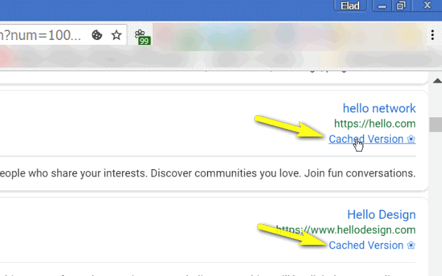

<h1> Google-Cache-Links</h1>

☞︎ Google Search Results With Google-Cache Links, Back Again!

 

Currently support google.com, google.co.il, google.co.uk.

I've basically made this web-extension for myself, and then decided to share it with everyone, because sharing is caring. it's nothing fancy but it is small, quick and it works. If you've enjoyed using it I'll be thrilled to hear all about it in the review section. 

100% free (as beer..), include no ads (I hate those!), does NOT collect any data, includes NO analytics and works entirely offline.

<pre>
Developer's HUB / Changelog

1.0.0.4
* additional repeat main method check, with alarms-api.

1.0.0.3
* fixing URL extraction.

1.0.0.2
* fixing matching of parts of redirect-url.

1.0.0.1
+ initial.
</pre>

