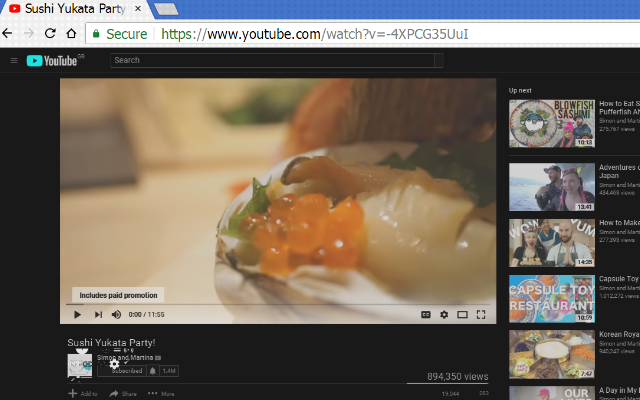
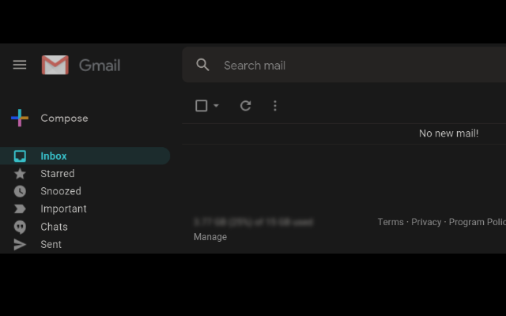

<h1> Invert</h1>

☞︎ Pure CSS, Screen-Color Invertion. ◑︎➛︎◐︎

This web-extension inverts the color-theme for the whole website, 
there are no specific website rules, no JavaScript and no bloated set of CSS-rules to load, 
there are very few CSS-rules applying invertion filter to the whole website, 
with few fixes to apply "default" color-theme.

It works quite well for most websites, including YouTube, eBay, GMAIL, Amazon,...

Some known issues:
- images and video elements will be inverted back to be shown normally, with a slightly darker hue,
places in the web-page where the image is set using a CSS-rule of 'background-image' (instead of an IMG-element) it will be kept inverted.
- VIDEO-elements in full screen might be shown inverted when the mouse will be hover-in/out of the element.
- some websites will have white-space kept near the bottom.

  
  
  

<pre>
Developer's HUB / Changelog

1.0.0.4
* using ':root' instead of 'html' in some of the selectors, also overriding ':root:hover' to fix a mouse-movement related bug where the colors switched on/off.
* moving overriding invert of 'IMG' and 'VIDEO'-elements to a different block.
* applying 'default' background-color only to a limited selection of elements - ':root', 'body' and all the first-layer elements under 'body'.
* only providing 'default' color for ':root','body', and first-layer of elements under 'body' which are not 'A'-elements.
- removing the 'added thickness' (text-shadow/text-stroke).
- removing the fixing of 'added thickness' to 'A'-elements.

1.0.0.3
* simplified CSS-rules to (override) instead of ':not()', simplified the A-element-color-fix as-well.

1.0.0.2
+ adding semi-transparent 'text-stroke' and 'text-shadow' to help 'thicken-up' type-fonts that uses weird color set.
+ specifying 'blue' (default link) generic fix for 'text-stroke' and 'text-shadow'.
- removing '@namespace "http://www.w3.org/1999/xhtml";' prefix to allow the CSS-rules to be applied to SVG "containers" (images) as well, since those uses the "http://www.w3.org/2000/svg" namespace.
+ adding a nice trick - for applying 'filter:invert(100%)' I set it for HTML-element (to apply, once, for all) and then to IMG and VIDEO-elements as-well, which will invert-the-invert (show normal).

1.0.0.1
+ initial.
</pre>

<!--  -->