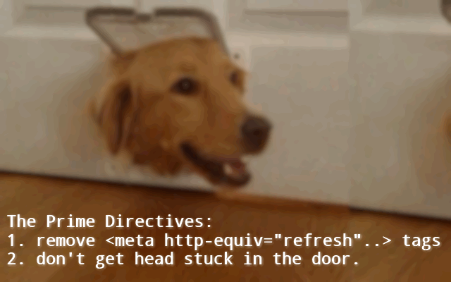

<h1> Chrome-Extension-Meta-Refresh-Killer</h1>

<h2>Kills ☠︎ meta http-equiv="refresh" Tags 𝗕𝗘𝗙𝗢𝗥𝗘 They Refresh/Redirect You! ★★★★★</h2>

<h2>Save memory: Only enable this extension when needed<h2>
<h3>For example to stop one website from refreshing over-and over again...</h3>

<h3>Set to <strong>Disabled</strong>: <code>chrome://flags/#disallow-doc-written-script-loads</code></h3>

𝙈𝙚𝙩𝙖-𝙍𝙚𝙛𝙧𝙚𝙨𝙝-𝙆𝙞𝙡𝙡𝙚𝙧 helps you by:

⏰︎ Preventing the page from self-refresh.

↬︎ Preventing the page from being redirected.

🙆︎ Keeping 𝙮𝙤𝙪 in control.

✿︎ ❀︎ ❁︎ ✿︎ ❀︎ ❁︎ ✿︎ ❀︎ ❁︎

👔︎ Pro Tip ⧣𝟭: 

Have JavaScript disabled globally?
Good! it will keep you safe!

This is how some web-developers will try to force you to enable it again for their websites:

&lt;noscript&gt;
  &lt;meta&#32;http-equiv&equals;&apos;REFRESH&apos;&#32;content&equals;&apos;0&semi;URL&equals;&period;&period;&period;&apos;
&lt;&sol;noscript&gt;

But now you don't have to!
𝙈𝙚𝙩𝙖-𝙍𝙚𝙛𝙧𝙚𝙨𝙝-𝙆𝙞𝙡𝙡𝙚𝙧 will allow you to view any page without getting redirected.

✿︎ ❀︎ ❁︎ ✿︎ ❀︎ ❁︎ ✿︎ ❀︎ ❁︎

⧣𝟮 uninstall AdBlock/AdBlock Plus
install 𝙪𝘽𝙡𝙤𝙘𝙠 𝙊𝙧𝙞𝙜𝙞𝙣. AdBlock had sold-out.

✿︎ ❀︎ ❁︎ ✿︎ ❀︎ ❁︎ ✿︎ ❀︎ ❁︎

⧣𝟯 install 𝙍𝙚𝙢𝙤𝙫𝙚-𝙍𝙚𝙙𝙞𝙧𝙚𝙘𝙩𝙨
it keeps you from clicking on redirect-links.

chrome.google.com/webstore/detail/bckcmceomgfhebkfbogignipjenidnmp

✿︎ ❀︎ ❁︎ ✿︎ ❀︎ ❁︎ ✿︎ ❀︎ ❁︎

⧣𝟰 Disable JavaScript and cookies globally
(chrome://settings/content)

You can later enable them just for few safe websites.

You can safely enable JS&cookies for Google, YouTube and Facebook, by adding those entries:
[*.]google.com
[*.]youtube.com
[*.]facebook.com
to:
(chrome://settings/contentExceptions#cookies)
(chrome://settings/contentExceptions#javascript)

You easily enable new websites in-case needed using the new icons for disabled JS/cookies on the your address-bar.

✿︎ ❀︎ ❁︎ ✿︎ ❀︎ ❁︎ ✿︎ ❀︎ ❁︎

<strong>When this web-extension will only work partially (not a full API-blocking)?</strong>
Some servers can prevent external-JavaScript from running on their pages, this includes JavaScript from web-extensions. It is usually done by serving the web-page with an additional 'Content-Security-Policy' header with the value 'default-src none', for example (https://addons.mozilla.org does it, and it prevents all, no just mine, web-extensions from working on that sub-domain). There isn't much to do in that matter, Firefox was designed to block web-extensions' JavaScript in those cases (yes, this web-extension's JavaScript too). When ever possible, I add an additional network-filter to each of my web-extension, for an increased security, those will always keep on working.

I've basically made this web-extension for myself, and then decided to share it with everyone, because sharing is caring. it's nothing fancy but it is small, quick and it works. If you've enjoyed using it I'll be thrilled to hear all about it in the review section. 

100% free (as beer..), include no ads (I hate those!), does NOT collect any data, includes NO analytics and works entirely offline.

<pre>
Developer's HUB / Changelog

3.1.1.16
* permission update for closed-tabs check before updating web-extension badge-number.

3.1.1.15
* making the messages.json Mozilla-server-friendly without 'opening-tag' character (using Unicode value instead).

3.1.1.9
* improving cross-browser-API compatibility.

3.1.1.8
* improving clean-up of the current DOM, unloading as much objects from the global-scope as possible, before loading the "no-redirects" modified HTML, this helps to prevent double objects, when loading SCRIPT elements again... :]

3.1.1.5
+ added support for Chrome's idle state.
- reduce package size.
- limit re-discovery to once per-page life-cycle state-change (load/ready).

3.1.1.4
* meta data update.

3.1.1.3
* code-refactor to use DOM-structure (OO) instead of text-based modifications.
+ fix badly written web-pages that loads http: resources into https: pages (mix-content fix) to avoid warnings.
* optimized engine's performances.

3.0.9.2
* apply action to main and all of the sub-frames (if any).

3.0.9.1
+ adding some more break-point for invalid frames.

3.0.8.1
* engine update.

3.0.7.1
+ badge info total of meta-refresh tags removed (usually just one..)
* engine update: were no meta refresh tags? do nothing.

3.0.6.1
* engine update: minimize stream write usage.

3.0.5.2
+ initial.
</pre>

<!--  -->