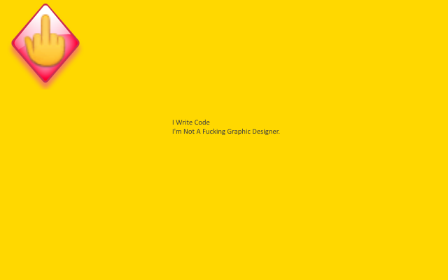

<h1> Chrome-Extension-Popup-🖕</h1>

You = Safe. Pop-Ups = 🖕︎!

<strong>When this web-extension will only work partially (not a full API-blocking)?</strong>
Some servers can prevent external-JavaScript from running on their pages, this includes JavaScript from web-extensions. It is usually done by serving the web-page with an additional 'Content-Security-Policy' header with the value 'default-src none', for example (https://addons.mozilla.org does it, and it prevents all, no just mine, web-extensions from working on that sub-domain). There isn't much to do in that matter, Firefox was designed to block web-extensions' JavaScript in those cases (yes, this web-extension's JavaScript too). When ever possible, I add an additional network-filter to each of my web-extension, for an increased security, those will always keep on working.

I've basically made this web-extension for myself, and then decided to share it with everyone, because sharing is caring. it's nothing fancy but it is small, quick and it works. If you've enjoyed using it I'll be thrilled to hear all about it in the review section. 

100% free (as beer..), include no ads (I hate those!), does NOT collect any data, includes NO analytics and works entirely offline.

<pre>
Developer's HUB / Changelog

1.0.5.11
* fixing allowlist method.

1.0.5.10
* better 'top' isolation.

1.0.5.9
* adding support for badge.

1.0.5.3
* holding element-query multi-line string without the use of multiline method.

1.0.5.2
+ iframes that are the child of ebay domain (and part of its sh!tty "proxy" loading of about:blank iframes).

1.0.5.1
+ another ebay domain to exclude, used for script-loading-f*ck! :[

1.0.4.8
+ excluding youtube since its new UI uses global listeners.

1.0.4.7
+ excluding *.eBay.* hostname since it uses document.write and eval (in review pages).
* adding some other descriptions/reorder exception-rules (readability).

1.0.4.6
* ignore-rules: ignore on github.com domain, since github.com uses listeners for menues.

1.0.4.5
+ double the effort of blocking bad-objects- in additional to deleting the object reference itself, try to delete actual objects (by its reference).
* workaround early-loading-stage (before body) empty script-injection by using innerHTML instead of text-node-child to set the injector content.

1.0.4.2
+ adding some do-not-track directives, that some websites respect..

1.0.3.1
+ allow local-network since routers web-software uses eval :(

1.0.2.3
+ allow godaddy websites

1.0.2.1
+ disables HTML5 history-api, to make browsers fallback into normal browsing.

1.0.1.1
+ why block some evil things

1.0.0.7
+ exclude my domains and Google domains (did you know that gmail uses document.write ... :/ )

1.0.0.5
+ initial.
</pre>

<!--  -->