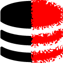
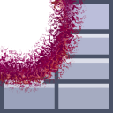
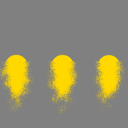

<h1>chrome_extensions - &nbsp; &nbsp; </h1>

<h2>Install <a href="https://github.com/eladkarako/chrome_extensions/releases/tag/LatestFirefox">Latest Releases - Firefox</a> (signed by Mozilla)</h2> 

<h2>Install <a href="https://github.com/eladkarako/chrome_extensions/releases/tag/LatestChrome">Latest Releases - Chrome</a> (signed by Google-Store)</h2> 

<h3>Complete Readme/Changelog: <em>(No Source)</em></h3>

 <a href="AndroidFileHost-Fix/"         > AndroidFileHost-Fix</a>
 <a href="API-Killer-Beacon/"           > API-Killer-Beacon</a>
 <a href="API-Killer-Beacon-NextGen/"   > API-Killer-Beacon-NextGen</a>
 <a href="API-Killer-Cookie/"           > API-Killer-Cookie</a>
 <a href="API-Killer-GeoLocation/"      > API-Killer-GeoLocation</a>
 <a href="API-Killer-History/"          > API-Killer-History</a>
 <a href="API-Killer-IndexedDB/"        > API-Killer-IndexedDB</a>
 <a href="API-Killer-Storage/"          > API-Killer-Storage</a>
 <a href="API-Killer-WebAssembly/"      > API-Killer-WebAssembly</a>
 <a href="API-Killer-WebRTC/"           > API-Killer-WebRTC</a>
 <a href="API-Killer-WebSocket/"        > API-Killer-WebSocket</a>
 <a href="AutoComplete-Enabler/"        > AutoComplete-Enabler</a>
 <a href="Behind-The-Asterisks/"        > Behind-The-Asterisks</a>
 <a href="Boostaler/"                   > Boostaler</a>
 <a href="Capture/"                     > Capture</a>
 <a href="CORS/"                        > CORS</a>
 <a href="CSS-Image/"                   > CSS-Image</a>
 <a href="Direct-CNET/"                 > Direct-CNET</a>
 <a href="Direct-FileHippo/"            > Direct-FileHippo</a>
 <a href="Direct-MediaFire/"            > Direct-MediaFire</a>
 <a href="Direct-ZippyShare/"           > Direct-ZippyShare</a>
 <a href="eBay-Boxed/"                  > eBay-Boxed</a>
 <a href="eBay-Sorters/"                > eBay-Sorters</a>
 <a href="eBay-UnPromote/"              > eBay-UnPromote</a>
 <a href="Editable/"                    > Editable</a>
 <a href="Ellipsis-Fix/"                > Ellipsis-Fix</a>
 <a href="Enabler/"                     > Enabler</a>
 <a href="Full-ON/"                     > Full-ON</a>
 <a href="Gallery-Break/"               > Gallery-Break</a>
 <a href="GitHub-Download-List/"        > GitHub-Download-List</a>
 <a href="Google-Cache-Links/"          > Google-Cache-Links</a>
 <a href="HOSTS/"                       > HOSTS</a>
 <a href="HTML5-Forcer/"                > HTML5-Forcer</a>
 <a href="HTTPS-Fix/"                   > HTTPS-Fix</a>
 <a href="ImageAlt/"                    > ImageAlt</a>
 <a href="Invert/"                      > Invert</a>
 <a href="Lazify/"                      > Lazify</a>
 <a href="Linkify/"                     > Linkify</a>
 <a href="Meta-Refresh-Killer/"         > Meta-Refresh-Killer</a>
 <a href="MirrorX/"                     > MirrorX</a>
 <a href="Name-Cleanup/"                > Name-Cleanup</a>
 <a href="NoJS/"                        > NoJS</a>
 <a href="Reddit-Old/"                  > Reddit-Old</a>
 <a href="Pandora-Text-Select-Enabler/" > Pandora-Text-Select-Enabler</a>
 <a href="Pleasant-Web/"                > Pleasent-Web</a>
 <a href="PopUpsFU/"                    > PopUpsFU</a>
 <a href="Real-URL/"                    > Real-URL</a>
 <a href="Remove-Redirects-Plus/"       > Remove-Redirects-Plus</a>
 <a href="Smooth-Scroll/"               > Smooth-Scroll</a>
 <a href="Speedy-Rendering/"            > Speedy-Rendering</a>
 <a href="SpellCheck-Enabler/"          > SpellCheck-Enabler</a>
 <a href="SPF-Killer/"                  > SPF-Killer</a>
 <a href="UnFooter/"                    > UnFooter</a>
 <a href="UnHook-Root/"                 > UnHook-Root</a>
 <a href="UnLazy/"                      > UnLazy</a>
 <a href="Unsecure/"                    > Unsecure</a>
 <a href="UserAgent/"                   > UserAgent</a>

 <a href="_res.7z"                      >_res.7z</a>

<!-- 
Code minifying:
according to the Mozilla policy I no longer able to submit obfuscated web-extensions to their website, so I've edited my generation script to stop after applying a minification using Google-Closure-Compiler, which only changes the variable names to shorter versions and keeps all the strings (and such), you essentially can understand everything in there by running the javascript through something such-as the jsbeautifier website.
-->

 
<a href="https://github.com/eladkarako/partial-download-github-repository">How To Download A Single Folder?</a>
