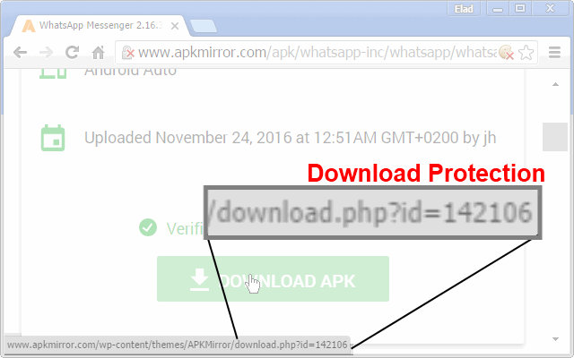
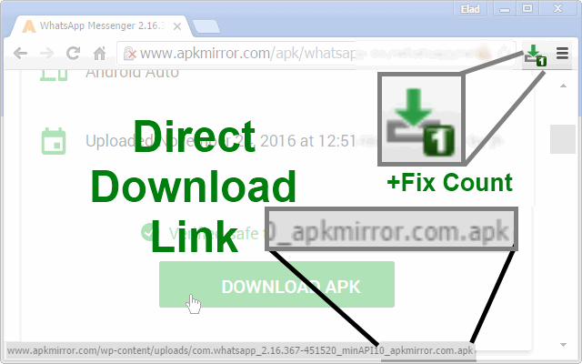
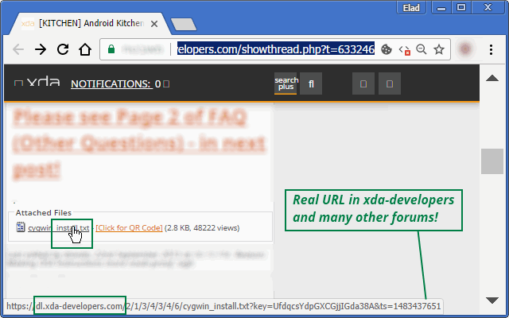

<h1> Chrome-Extension-Real-URL</h1>

<strong>network-resolve a redirect-link (302-redirect) to the direct-link target</strong>, 
from websites that are based on XDA-forums, WordPress, bb-forums, and other PHP-based download-managers, 
essentially - saving you a few clicks and allowing you to copy the link into a download manager.

In most cases links might expire or it can overload the server putting you on hold (especially on XDA).

It makes your browsing experience more secure, by allowing you to see
what is the real target of the link, without actually following it,

This also means you save yourself ads, click-baits any many malicious-contents.

It help you save time, by skipping waiting-screens and download-pages,

You can even copy the real-URL into a multi-part download-managers,
such as FlashGet, JDownloader, Orbit-Downloader or aria2c to download in a much faster-speeds than you were intended to.

More Speed Bonus!
The Real-URL extension follow all of the 301/302 redirect-chains,
It also resolve URLs, so when you'll be finally click the link,
You skip all DNS-resolving, go ahead directly to the final target.

Currently handles:
- All WordPress based-on websites. [for example: APKMirror.com]

<h3>This Extension Is A HUGE Time-Saver!!!</h3>

<strong>When this web-extension will only work partially (not a full API-blocking)?</strong>
Some servers can prevent external-JavaScript from running on their pages, this includes JavaScript from web-extensions. It is usually done by serving the web-page with an additional 'Content-Security-Policy' header with the value 'default-src none', for example (https://addons.mozilla.org does it, and it prevents all, no just mine, web-extensions from working on that sub-domain). There isn't much to do in that matter, Firefox was designed to block web-extensions' JavaScript in those cases (yes, this web-extension's JavaScript too). When ever possible, I add an additional network-filter to each of my web-extension, for an increased security, those will always keep on working.

I've basically made this web-extension for myself, and then decided to share it with everyone, because sharing is caring. it's nothing fancy but it is small, quick and it works. If you've enjoyed using it I'll be thrilled to hear all about it in the review section. 

100% free (as beer..), include no ads (I hate those!), does NOT collect any data, includes NO analytics and works entirely offline.

<pre>
Developer's HUB / Changelog

2.0.8.2
* better define methods.

2.0.7.10
* code-refactor.

2.0.7.5
* improved engine.
+ added support for Chrome's idle state.
- reduce package size.
- limit re-discovery to once per-page life-cycle state-change (load/ready).

2.0.7.2
+ also resolve refresh-tags :]

2.0.6.9
* adding some PHP-redirect resolving, that required fetching of the target (works great with with "remove-redirect" extension: https://github.com/eladkarako/Chrome-Extension-Remove-Redirects/)

2.0.6.8
* fix engine-loading.

2.0.6.7
+ error handling

2.0.6.5
* engine update - improve discovery query.

2.0.6.4
+ error handling

2.0.6.2
* adding prototyping for browser compatibility.

2.0.6.1
* tag-number updated instead of overriding it.

2.0.5.3
+ adding handling of attachment-links, this will show the real-links in many(!) bb-forums (such as xda-developers forums).

2.0.4.1
* back to WordPress-like pages only, as an operation-limiter.

2.0.3.3
+ add request-status to element's info-attributes.

2.0.3.1
* only handle https-to-https and http-to-https/http, query it in early-stage in the code, which is a more efficient way then later-filtering.
+ quite error-handling of open/send (to support early blocking in AdBlock/uBlock extensions sending 40* to hard-block nasty urls ;] )

2.0.1.1
+ enhanced security, play safe on SSL and different-domains.

2.0.0.1
* project architecture, support execution on pages with and without JavaScript support, no code-duplication using the scope of the chrome-extension.

1.0.0.8
+ resolve all links, not just WordPress. resolve 30* codes and update the REAL url directly into the page.

1.0.0.5
+ initial
</pre>

<!--  -->