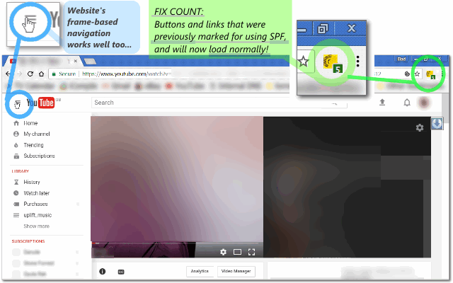

<h1> SPF-Killer</h1>

<h3><em>★★★★★ Back To Standard Browsing! ꗷ︎</em></h3>

Disabling the SPF engine is quite easy,
all you have to do it add <code>/spf.js</code> to your uBlock-origin adblock-list...

read more about it in here: <a href="http://icompile.eladkarako.com/disable-youtube-spf/"><em>iCompile -</em> Disable YouTube SPF</a>
<h3>But <strong>DON'T!</strong></h3>

For YouTube, you can add those to UBlock-origin (under "my filters") reduce some common sh!t
<pre>
youtube.com/api/stats

youtube.com/ptracking

youtube.com/pagead

google.com/pagead

google.co.il/pagead

youtube.com/youtubei/v1/log_event

youtube.com/youtubei/v1/log_interaction

google.com/uds/stats

google.co.il/uds/stats

youtube.com/csi_204

youtube.com/player_204*pagead

youtube.com/player_204*adunit

/videogoodput

youtube.com/get_midroll_info

youtube.com/annotations_invideo*instream_ad

yt1.ggpht.com/proxy

yt2.ggpht.com/proxy

yt3.ggpht.com/proxy
</pre>

many Google based websites do not have a proper fallback to standard-browsing anymore,
leaving you with much of the functionality missing,

Don't belive me?
Try YouTube with uBlock-origin and the custom rule: <code>/spf.js</code>.
Most of the menus will not respond well, and video-transitions in playlist will but unusable.

This is YouTube was not properly coded with a fallback in-case the JavaScript of SPF will be disabled, but the other functionality will kept enabled. So it is best to <strong>keep loading <code>/spf.js</code></strong>, but providing a workaround that will limit the usability of the loading-engine,

Effectivly giving you a <strong>SPF-Free</strong> website, without breaking anything.

<h3><em>SPF-Disabler</em> provides several solutions working heuristically side-by-side, Bringing you back the standard-browsing experience.</h3>

<pre>
Developer's HUB / Changelog

1.2.6.9
* permission update for closed-tabs check before updating web-extension badge-number.

1.2.6.8
* revert some event-handlers to prevent reloading-loops...

1.2.6.6
* improving cross-browser-API compatibility.

1.2.6.1
* observing DOM changes more closely.

1.2.5.3
+ adding "self.yt" to the known pre-set configuration-containers.
+ "config_" sub-key for each of the configuration containers.
+ reducing hooking-event on document in favor of window/self - for event that do permeates/bubble up to window.

1.2.5.2
+ running main logic on resize/transitionend/visibilitychange DOM-events which is commonly used in YouTube's material-design, this helps fixing "new links" that are added when clicking "Load more" button.

1.2.5.1
* moved polymer handling code to top of the method, so if there is a redirect at-hand, it would be done asap, without running the common-tasks of the extension (since there will be navigation to another page anyway...).
+ handling SPF and session classes in a generic-heuristic way (plus some SPF attributes- data-spf-name)
* code reduced, noted and sectioned.

1.2.4.5
* removing interval (timeout) in favor of 'yt-page-*' and 'yt-navigate-*' event listenning.

1.2.4.4
+ soft disabling polymer and SPF through YouTube's stored EXPERIMENT_FLAGS

1.2.4.2
* making the injected-code an internal function, - and then using it, as string for injection, this makes it available for execution through the Chrome-extension scope too.
+ engine need to use setInterval since SPF custom-events are not always captured by standard-event handlers, generic window listeners won't help...
+ override SPF navigate method with classic assign method, as a fallback to soft-disabling it with the config-objects.

1.2.4.1
+ (re)adding hard-coded '_spf_state' and 'ytspf' rewrite to any self-window, hopfully to trigger fallback code (even objects were not existed) --- This is in additional to "discovering" a "SPF like" object in self-window anyway.
+ adding 'enabled=false' (and 'config.enabled=false') attributes, found in some old SPF engines online (that might still trigger fallback to regular browsing).
* fixing some typos in string-replace without target + using multiline regex directive.

1.2.3.1
+ using the "disable_polymer=1" on links and page-location.
+ limiting to youtube domains only.

1.2.2.4
+ limit operation for text/html documents (ignore xml, rss, etc...)

1.2.2.3
* improved script injection on early page-loading stages (no body).

1.2.1.1
+ inject fixing script to DOM, for specific window-SPF-like objects (heuristic) as queried from extension-context-scope.
* accurate counter update per needed objects.
* execute code in blocking code-block, rendering will halt until exeuted. Good thing, more secure.

1.0.9.1
- fork-out (ha!) History-API-Disabler chrome-extension
* reduce code, making SPF-like object discovery dynamic both in extension-scope and in page-scope injection.

1.0.8.1
+ disables HTML5 history-api so websites will fallback to normal browsing.

1.0.7.1
* does an improve discovery for SPF objects on the page, without actually pre-knowning their name. Will help discovery custom-SPF-products such as "ytspf" (youtube's SPF product) and will make the discovery code more heuristic and less hard-coded ;)

1.0.6.1
+ detaching some of the code to be ran from pure-DOM scope, override protection/isolations.

1.0.5.1
+adding support 'history-error-callback' in additional for 'navigate-part-received-callback' which is no-longer available for newer versios of SPF.js
+listening to window/document SPF events (done/partdone are useful the rest are heuristics)

1.0.4.1
+ improved counting and updating description of fixes in the badge-icon.

1.0.3.2
* only apply the SPF-limit fix if there is a evidence of SPF configuration object in the DOM.

1.0.3.1
+ initial (no versioning while product was in-alpha developing :| ).
</pre>

 

<!--  -->