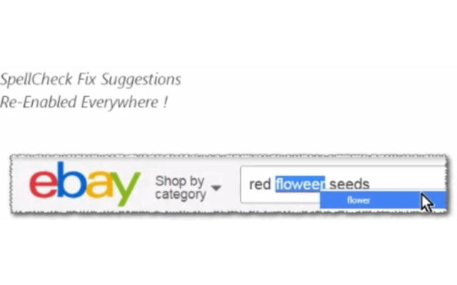

<h1> SpellCheck-Enabler</h1>

This web-extension will allow the built-in spellcheck feature of Firefox to be activated in every text-field, in every-page you visit, regardless if that website allows (or god forbid) blocked the spellcheck feature in that text-field.

<strong>Firefox Users</strong>
You must install at-least one spell-dictionary from: 
https://addons.mozilla.org/en-GB/firefox/language-tools/

<strong>Chrome Users</strong>
You already have a dictionary, it is native to the language of your browser.
You can replace it or install an additional dictionary, following instructions in: https://www.ghacks.net/2014/04/30/add-languages-google-chromes-spell-checking-functionality/ 

There is another web-extension (named 'AutoComplete-Enabler') that acts similar way, 
allowing the browser's built-in autocomplete-feature on every text-field, and it synced with your profile as-well. It may save you a lot of typing...

<strong>Additional Note, For Chrome Users:</strong>
There is a way you can make the <strong>spellcheck</strong> process run in the background,  
which is useful on large-amount of texts.  
Either change: <code>chrome://flags/#enable-idle-time-spell-checking</code> (<code>Enable idle time spell checker</code>) to <code>enabled</code>,  
or add to the command-line (just after your <code>chrome.exe</code>) <code>--enable-blink-features="IdleTimeSpellChecking" --enable-features="IdleTimeSpellChecking"</code>.

<strong>When this web-extension will only work partially (not a full API-blocking)?</strong>
Some servers can prevent external-JavaScript from running on their pages, this includes JavaScript from web-extensions. It is usually done by serving the web-page with an additional 'Content-Security-Policy' header with the value 'default-src none', for example (https://addons.mozilla.org does it, and it prevents all, no just mine, web-extensions from working on that sub-domain). There isn't much to do in that matter, Firefox was designed to block web-extensions' JavaScript in those cases (yes, this web-extension's JavaScript too). When ever possible, I add an additional network-filter to each of my web-extension, for an increased security, those will always keep on working.

I've basically made this web-extension for myself, and then decided to share it with everyone, because sharing is caring. it's nothing fancy but it is small, quick and it works. If you've enjoyed using it I'll be thrilled to hear all about it in the review section. 

100% free (as beer..), include no ads (I hate those!), does NOT collect any data, includes NO analytics and works entirely offline.

<pre>
Developer's HUB / Changelog

5.0.4.3
* additional repeat main method check, with alarms-api.

5.0.4.2
* cleanup old events-hooks.

5.0.4.1
* slight engine modification.

5.0.3.6
* improving cross-browser-API compatibility.
* holding element-query multi-line string without the use of multiline method.

5.0.3.4
+ limit operation for html documents (ignore xml, rss, etc...)

5.0.3.3
* improved background-counter efficiency.

5.0.3.2
* improved engine, reverting to standard (non-passive) event handler to be compatible with older Chrome versions.
+ adding js-navigation/SPF dynamic page- triggers for main-fix action.

5.0.2.4
+ eBay (and others) tries to disable the autocomplete and spellcheck, adding solutions that will - efficiently and tolerantly - WILL KEEP autocomplete and spellcheck ENABLED :]]

5.0.2.3
+ added support for Chrome's idle state.
- reduced resources size.
- removed re-discovery, now elements will be rediscovered only once per load/ready in page's life-cycle.

5.0.2.2
* improved engine.

5.0.1.3
* improved element-discovery query, to ignore elements hidden by adblocking clients (identified by 'hidden' in-line attribute).

5.0.1.2
* improved element discovery.

5.0.1.1
* remove state flag in-favor of real-state.

5.0.0.1
* handle autocomplete quirks with HTML5 prediction for autocomplete, to favor browser's default behavior.
* clean-up scope.

4.0.7.1
* improved heuristics patterns.
* improved query.

4.0.5.1
+ verbose status, while trying heuristics to resolve attributes repeatedly disabled (first clone than remove attributes than nothing) may stopped anytime both on success by query and on undiscovered success in-loop (really unlikely since query should catch it..) .

4.0.4.1
+ reintroduced event unhook, with regexp to exclude hostnames (for example ones with "*mail*" in-it).

4.0.3.3
* fix engine-loading.

4.0.3.2
+ error handling

4.0.3.1
- removing unhooking functionality for best website-compability.
* improved element-discovery query.

4.0.2.9
* don't unhook event-handles on Google domains.

4.0.2.7
* correct element-count.

4.0.2.6
* improve discovery elements- not hidden elements.
+ adding exception to never unhook-events (in second-phase), based on domain name (for example gmail), to preserve functionality.

4.0.2.5
* improve element-discovery-query, omitting input-types that has no-need for autocomplete/spellcheck (button/file/image/...).
+ improve algorithm's overall-efficiency!

4.0.2.1
* engine update: smart-heuristics for websites that tries to change autocomplete/spellcheck back (such as eBay's onchange in the main-search input element) - resolved by unhooking those events :] -- ha! ha!!

4.0.1.1
* engine update with addressing form-elements too.
* internal upgrade of query assembly.

4.0.0.6
* engine query update, more efficient discovery removing cases where the text-containers are already set ok'ly, and ignore readonly/disabled text containers (you may download <a target="_blank" href="https://chrome.google.com/webstore/detail/jcgjifkfonefkppobfgckphhmaafodoi/">"Enabler"</a> chrome-extension to enable those..)

4.0.0.5
* engine flag fix

3.0.1.7
* engine fix, for repetition-flag

3.0.1.4
* limit repetition by flag done-elements.

3.0.1.3
+ error handling

3.0.1.2
* adding prototyping for browser compatibility.

3.0.1.1
* tag-number updated instead of overriding it.

3.0.0.1
* project architecture, support execution on pages with and without JavaScript support, no code-duplication using the scope of the chrome-extension.

2.0.0.8
* engine run-state fine tuning.

2.0.0.5
- removing HTTP-headers-modifications and unneeded permissions.

2.0.0.4
+ initial (no versioning while product was in-alpha developing :| ).
</pre>

<!--  -->