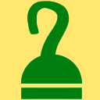

<h1> UnHook-Root</h1>

You're entering a website, and when you try to click a button or a link - you get a PopUp opened in a window or a new tab, 
you go ahead and close it, go back to the website and now the button or the link works as expected. 

Both Chrome and Firefox have ways to prevent PopUps, but usually they both yield when there is a <strong>true</strong> user-interaction on the page, for example a click, 
now days web-owners won't place an auto-opening PopUp simply because it won't work, the browser won't open it, 
so "they steal" the first user-interaction with the website, putting simply, to make money, 
essentially forcing the user to "click an ad" (even an invisible one!).

<strong>This web-extension prevents any mouse or touch events from hooking directly the HTML or BODY tags.</strong>

Blocked events:
<ul>
<li><code>click</code>, <code>dblclick</code>, <code>mouseup</code>, <code>mousedown</code></li>
<li><code>touchstart</code>, <code>touchend</code>, <code>touchmove</code>, <code>touchcancel</code></li>
</ul>

<strong>Again, with the war against PopUps.</strong>
Hooking HTML or BODY tags for click (for example) is a common way used to trigger PopUp opening, 
which is annoying. 
Usually the user is unaware of the fact that clicking (effectivly <strong>anything</strong> under the HTML or BODY tag) will open the PopUp.

<strong>Keyboard/Scroll/Drag&amp;Drop are OK.</strong>
Hooks of <code>KeyboardEvent</code>, <code>WheelEvent</code> or <code>DragEvent</code> are not blocked, 
since they are (too) commonly used, and not commonly used as "popup-trigger" (well... wheel might?..).

<strong>Under the hood.</strong>
This web-extension make use of <a href="https://developer.mozilla.org/en-US/docs/Web/API/Event/stopImmediatePropagation"><code>stopImmediatePropagation</code></a> which not only prevents the click (for example) event from bubbling to ancestor elements but it prevents other listeners (a.k.a event handlers or "hooks") of the same event ("click" for example) from being called.

Another hacky alternative to unhook an event is to clone the node (<code>.cloneNode(true)</code>) but it is not advised to be used on root-like nodes due to the overhead of deep-cloning, plus, it will cause to re-parse (...download and run) of SCRIPT tags, which can be messy...

If you are looking for a similar web-extension to help fight PopUps, 
that will block commonly used JavaScript methods, you may try 
https://addons.mozilla.org/en-GB/firefox/addon/pop-ups-fu/ 

<strong>When this web-extension will only work partially (not a full API-blocking)?</strong>
Some servers can prevent external-JavaScript from running on their pages, this includes JavaScript from web-extensions. It is usually done by serving the web-page with an additional 'Content-Security-Policy' header with the value 'default-src none', for example (https://addons.mozilla.org does it, and it prevents all, no just mine, web-extensions from working on that sub-domain). There isn't much to do in that matter, Firefox was designed to block web-extensions' JavaScript in those cases (yes, this web-extension's JavaScript too). When ever possible, I add an additional network-filter to each of my web-extension, for an increased security, those will always keep on working.

I've basically made this web-extension for myself, and then decided to share it with everyone, because sharing is caring. it's nothing fancy but it is small, quick and it works. If you've enjoyed using it I'll be thrilled to hear all about it in the review section. 

100% free (as beer..), include no ads (I hate those!), does NOT collect any data, includes NO analytics and works entirely offline.

<pre>
Developer's HUB / Changelog

1.0.0.10
* additional repeat main method check, with alarms-api.

1.0.0.9
* cleanup old event-hooks.

1.0.0.8
* registering the 'blocking event' 'with capture' so it will execute earlier then other events registered (https://stackoverflow.com/questions/7398290).

1.0.0.5
+ not returning false from the click handler since it can disable the actual event.

1.0.0.3
+ initial (no versioning while product was in-alpha developing :| ).
</pre>

<!--  -->