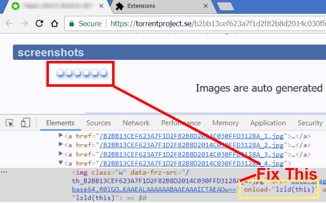

<h1> Chrome-Extension-UnLazy</h1>

This web-extension heuristically tries to kill dynamically-loaded images engines such as Google PageSpeed, then figure-out and place a clean, normal correct image in-place of the lazy-loaded one.

Lazy-loaded resources are beneficial only to the website owners, by saving them some traffic,
For us, the users it usually delays the showing of the images, and making the page heavy, slow and sluggish.

It works great on Amazon and eBay, loading all the images shown in the search-page without delay.
It works nice on YouTube, loading all the thumbnails at once, allowing you a quicker-loading page.
It works on many WordPress-based websites which commonly uses a "lazy load kit", and websites that uses the Google PageSpeed engine and various other websites due to a generic-matching algorithm.

In short, this web-extension will make images show faster.

=-=-=-=-=-=

This web-extension does not disables native-lazyloading in newer-browsers, 
it only handles 3rd-party solutions. In-fact, this web-extension will work very-well with native-lazyloading, 
since it makes everything uses plain-images, it makes it easier for the browser to handle it. Consider also using 'Lazify' which enhance the native support for native-LazyLoading.

=-=-=-=-=-=

Additional developer notes:
- This web-extension also tries to simplify the page's DOM-structure, 
for example when it uses a non-IMG-element to hold an image (a DIV-element), 
placing a clean IMG-element instead, simplifing the DOM-tree structure makes the page faster and more reactive.

- using a simple IMG is better, new browsers have the ability to use your multiple-core CPU to fetch, decode and render images in parallel, some will even make it more efficient and try to deligate the rendering-task to your GPU, making the whole process even more efficient.
LazyLoading breaks those abilities by forcing a linear processing of images, and because it is triggered by user-interaction over UI-components - it both makes the UI slower and slows down the entire image-fetch-render process, LazyLoading is nasty.

=-=-=-=-=-=

<strong>When this web-extension will only work partially (not a full API-blocking)?</strong>
Some servers can prevent external-JavaScript from running on their pages, this includes JavaScript from web-extensions. It is usually done by serving the web-page with an additional 'Content-Security-Policy' header with the value 'default-src none', for example (https://addons.mozilla.org does it, and it prevents all, no just mine, web-extensions from working on that sub-domain). There isn't much to do in that matter, Firefox was designed to block web-extensions' JavaScript in those cases (yes, this web-extension's JavaScript too). When ever possible, I add an additional network-filter to each of my web-extension, for an increased security, those will always keep on working.

I've basically made this web-extension for myself, and then decided to share it with everyone, because sharing is caring. it's nothing fancy but it is small, quick and it works. If you've enjoyed using it I'll be thrilled to hear all about it in the review section. 

100% free (as beer..), include no ads (I hate those!), does NOT collect any data, includes NO analytics and works entirely offline.

<pre>
Developer's HUB / Changelog

8.0.6.7
* changing the browser_specific_settings/gecko/id to "unlazy-alpha1@eladkarako.com" in-order to re-upload UnLazy to Mozilla-servers.

8.0.6.4
* mark the Unlazy'ed-images so it can later be addressed by CSS to reveal opacity/display/visibility properties.

8.0.6.3
+ add CSS hard-overriding rules to reveal images: opacity, display, visibility. rather than specifying a value I'm using "unset" to let the native definition of the browser take effect. For websites such as https://www.cxovoice.com/ that includes in the 'related-articles' a wrapping DIV to animate (with JavaScript) the loading of the image, nasty.

8.0.6.2
+ adding UnLazy-rule for images where the real-image is placed in an 'data-cvpsrc' attribute, used by WordPress based websites with the 'WPFastestCache' plugin which rewrite all images to lazyloading ones (not handling 'data-cvpset' since it rarely being used).

8.0.6.1
* fixing a bug regarding grabing the real SRC from the original-element.

8.0.5.2
* improving 'unhiding' images.

8.0.4.1
+ making the main-action JavaScript run as a repeat 'timed' alarm every 1 minute. Uses "alarms" for the 'timer' and "tabs" for executing JavaScript file. The JavaScript file 'at_document_idle.js' (with just 'action();') will executed starting from 'document_start+1minute' and will repeat every one minute. This is a friendly way running timed code that does not uses setTimeout nor setInterval.

8.0.3.5
+ adding case where the container is a 'DIV'-element with image-source in 'data-offscreen-lazy' property.
* improve building of image from div (in cases where the container is a DIV-element) with trying to get width and height of the container, assigning it to the clean-generated 'IMG'-element, fallback to 'rounding' the result of 'self.getComputedStyle()' (without fraction nor units, just a plain whole-number).

8.0.3.3
* fixing data-src case for cases where there isn't an empty/filler SRC attribute (old WordPress).

8.0.3.1
- removing more of the onload/onerror blocking.
- fixing a small bug, where a website uses picture with several sources, the data-srcset needs to be cleaned-up and semi-parsed to extract the correct URL for the clean image (for example see articles on main body of kotaku.com ).

8.0.2.21
- removing the onload/onerror blocking-load event since it requires too much CPU-load to manage.

8.0.2.20
+ adding a way to prevent late/dynamic 'onload' and 'onerror' hooking on the newly-created (clean) images by any LazyLoad-engine.

8.0.2.19
+ adding support for extraction from 'data-lazy-srcset' (commonly used by WordPress-lazyloading plugin) - first resource listed (while still prefering 'data-lazy-src' over, - it tries to extract it first).
* making the rule extraction for 'data-lazy-src' more generic so it will match better for 'not as strict' lazy-loading cases (mostly commonly used in WordPress).
* null'ifying the 'src' and 'srcset' before de-attaching the img by cloning (which helps to remove event handlers), lowers memory used(!) and improve object handling, plus it doesn't leave 'srcset=""' attributes around...

8.0.2.17
* removing the 'little gift' because the impolite review (https://addons.mozilla.org/en-GB/firefox/addon/unlazy/reviews/1317920/ : 1/5 and demanding support) was removed by 'caitmuenster'. Thanks!
* since matched-patterns are SRC based and not using SRCSET, I've 'empty-string'ed the SRCSET variable, in-one case the WordPress lazy-loading has set the SRCSET as well with a 1x1 temp. image, bug fixed with the help of this support-request from a Mozilla-review: https://addons.mozilla.org/en-GB/firefox/addon/unlazy/reviews/1322140/ . Thanks!

8.0.2.13
* removed mutation-observer, making the web-extension faster but might not work as well on dynamic-content.
* enhancing the 'little gift' with nice colors and stop loading the page asap. so funny Ha haaa Haaaa :)

8.0.2.12
* bring back the 'little gift' for specialized domains because it was so funny Ha haaa Haaaa :)

8.0.2.10
* fixing missing 'get source' from a generic lazy-loading attribute.
- removing gift for specialized domain, although it was pretty funny.

8.0.2.9
* adding a little gift for specialized domain.

8.0.2.8
+ remove 'lazy' marking in class-list, this helps to prevent various loading-engines from addressing the images even when the SRC was already fixed.
* include various WordPress generic-cases that uses data-lazy-src, data-lazy-srcset, and data-lazy-sizes attributes.
+ adding an 'unhide' tweak to handle pre-hidden content.

8.0.2.7
+ adding support for images with data-img-src markup for the real image.

8.0.2.6
* improving cross-browser-API compatibility.

8.0.2.5
* adding support for simple 'data-url' to replace 'src'.

8.0.2.4
* adding support for custom lazy-loading used in thinkgeek-website.

8.0.2.3
* small fix for eBay new page-structure with img/src (1x1pixel)/data-src (real image).

8.0.2.2
+ adding support of PICTURE-SOURCE as used in several blogs (lifehacker uses it).

8.0.2.1
* observing DOM-changes more closely, in addition to existing ways.

8.0.1.7
* listening to 'yt-page-*' and 'yt-navigate-*' events for page-content changing.

8.0.1.6
+ adding support for lazy-loading IMG-elements holding the real-image in 'data-echo' attribute, used in some online-carts pages.

8.0.1.5
+ adding support for images with 'data-lazysrc' attributes used in custom lazy-loading solutions.

8.0.1.4
+ adding flattening of "grid-images" (such in "nerdist.com" website) where the image is nesting with a lazy-loading (fallback is a loading-gif) with data-1x1 or data-2x2 attributes.
* providing global fix for cross-origin http-https mistakes in websites.

8.0.1.3
+ adding another variation of jQuery-lazy, common in video-galleries where the image hides under 'data-original' attribute.

8.0.1.2
* cleaning some CDN's non-sense syntax in final IMG URLs.

8.0.1.1
+ add support for several cases of "div as img" when it uses "data-src" and "data-original-src" attributes.
* split main code to two short cases of img/div as main containers.

8.0.0.2
* including generalized alternative/custom pagespeed functionality used in ebay.

8.0.0.1
* reduced functionality - handling just pagespeed.

7.0.3.3
* improved handling of SPF loading. Note that YouTube will still cache the webp animated-video previews, if you want to block it (since you will use the jpg static preview anyway) you should add something like this "ytimg.com/*/mqdefault_6s.webp" rule to your ublock-origin list, which will load the page faster.

7.0.1.1
* handling all images on the page and improved results heuristically.
+ dynamic-pages element discovering - efficiently and w/o timers!
* including non-mainstream hacks for YouTube's static/moving thumbnail.

6.2.0.9
+ prefer to always show the video-preview on YouTube.

6.2.0.8
+ adding support for YouTube animated-video thumbs.

6.2.0.7
+ adding fixout for lazy-loading images, being hidden, mostly used in youtube...

6.2.0.6
+ added support for Chrome's idle state.
- reduce package size.
- limit re-discovery to once per-page life-cycle state-change (load/ready).
- removed isolation.

6.2.0.4
* improve element-discovery.
+ adding "hiding"-removal.

6.2.0.3
* improve element-discovery-query for hidden or ad-blocked images.

6.2.0.1
* refactor code for global scope isolation (reduced memory print).
* refactor code for image background pre-caching outside of DOM (reduced reflow, reduced CPU).
* generic code-style refactor, to be slightly-less-centralised (reduce usage of anonymous-function in main loop since those are now cached-once and referenced onced in-look by name).
* specified ONLY handling of IMG elements - ignore IFRAMEs, although possible to being handled by this extension :../  ...and ignore SCRIPTs since it was never-meant to be handled by this extension :/

6.1.4.2
* improved element discovery (ignoring 'srcset' - which is a legitimate HTML5's attribute and not "lazy" related..)

6.1.4.1
+ add support for LazyLoading using generic 'js-preload'.

6.1.3.1
+ added generic heuristics-pattern matching for jQuery's LazyLoad.

6.1.2.7
+ added anti-YouTube-LazyLoading.

6.1.2.5
* refactor flag identification.

6.1.2.4
* improved flag definition.

6.1.2.3
+ added fix for unescaped-HTML-entities leftovers.

6.1.2.2
+ initial (mostly used in Google's PageSpeed LazyLoading - for example: used on eBay)
</pre>

<!--  -->