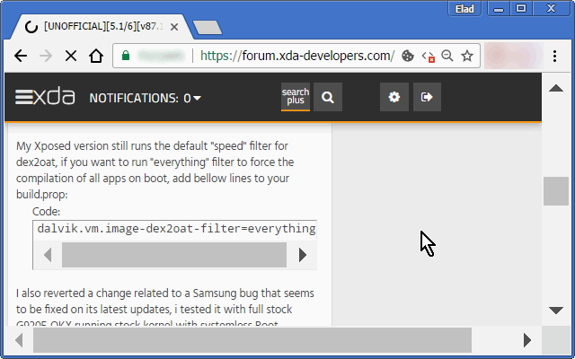
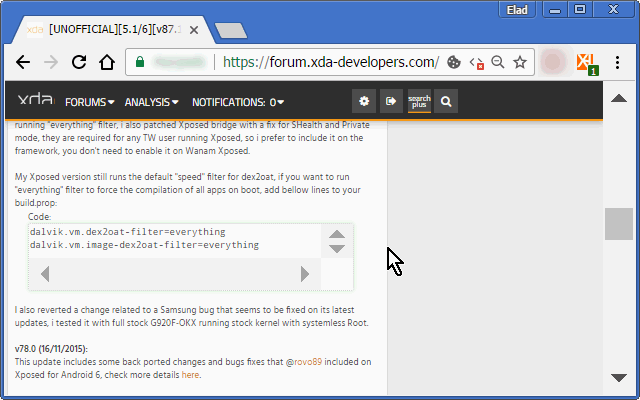
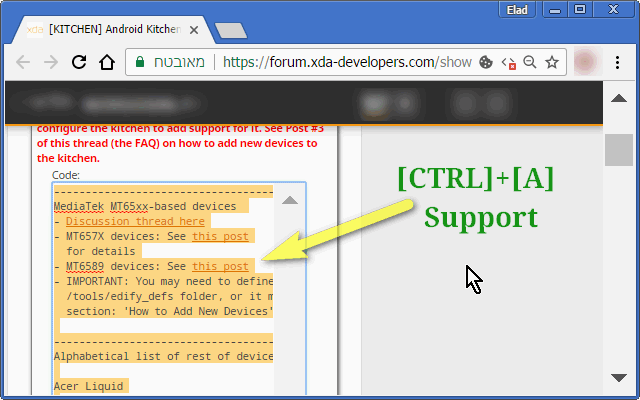
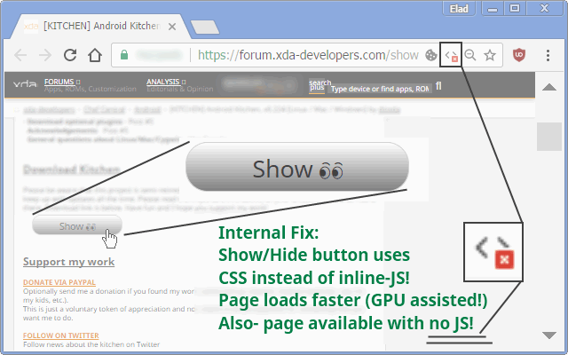
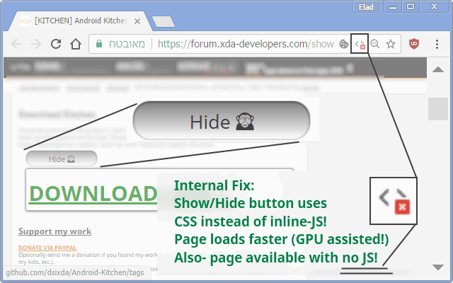
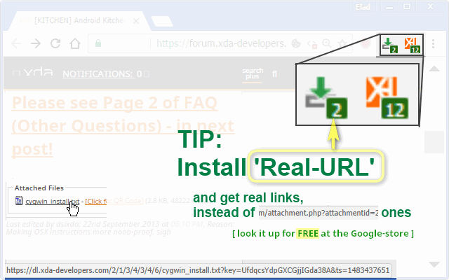

<h1> Chrome-Extension-XDA</h1>

<strong>☞︎ Enable Hidden Stuff + [CTRL][A]-Code-Select In XDA-Developers-Forums!</strong>

<em>Visual Tweaks For XDA-Developers' Forums.</em>

This web-extension makes the XDA blogs/forums easier to view on zoom-levels that are larger than 100% without the code areas being too-small, 
It replaces the hide/show system with a pure-CSS hide/show system, 
It allows to use CTRL+A to select all the text in code-segments, 
Fix links to have underline again 
and adds extra padding and aligning to various segments allowing them to be easier to read.

I've basically made this web-extension for myself, and then decided to share it with everyone, because sharing is caring. it's nothing fancy but it is small, quick and it works. If you've enjoyed using it I'll be thrilled to hear all about it in the review section.

The XDA web-extension is 100% free (as beer..), include no ads (I hate those!), does NOT collect any data, include NO analytics and works entirely offline.

<strong>This Extension Is A Great Work Enhancer!</strong>

<pre>
Developer's HUB / Changelog

3.0.2.11
* changing the browser_specific_settings/gecko/id to "xda-alpha1@eladkarako.com" in-order to re-upload XDA to Mozilla-servers.

3.0.2.8
* additional repeat main method check, with alarms-api.

3.0.2.7
* improving cross-browser-API compatibility.

3.0.2.1
* improved background counter efficiency.

3.0.1.9
+ added support for Chrome's idle state.
- reduce package size.
- limit re-discovery to once per-page life-cycle state-change (load/ready).
* 100% offline.

3.0.1.8
* fix engine-loading.

3.0.1.7
+ error handling

3.0.1.6
* flag fix

3.0.1.5
* limit repetition by flag done-elements.

3.0.1.3
+ error handling

3.0.1.2
* adding prototyping for browser compatibility.

3.0.1.1
* tag-number updated instead of overriding it.

3.0.0.1
* engine update.

2.0.0.5
+ initial (no versioning while internal-dev. cycle..)
</pre>

<!--  -->